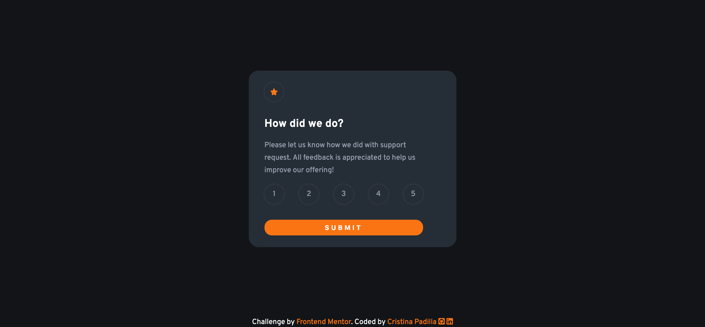

# Frontend Mentor - Interactive rating component solution

This is a solution to the [Interactive rating component challenge on Frontend Mentor](https://www.frontendmentor.io/challenges/interactive-rating-component-koxpeBUmI).

## Table of contents

- [Overview](#overview)
  - [The challenge](#the-challenge)
  - [Screenshot](#screenshot)
  - [Links](#links)
  - [Built with](#built-with)
  - [What I learned](#what-i-learned)
- [Author](#author)

## Overview

### Links

- Solution URL: [Check it out](https://component-rating.netlify.app/)

### Built with

- Semantic HTML5 markup
- CSS custom properties
- Flexbox
- Mobile-first workflow
- JavaScript

### What I learned

I learned how to interact with classes to activate and deactivate elements and I practised with the forEach method to iterate through different elements, applying them an addEventListener (click).

## Author

- Website - [www.cristina-padilla.com](https://www.cristina-padilla.com)
- Frontend Mentor - [Cristina Padilla](https://www.frontendmentor.io/profile/Mama-simba)
- Twitter - [@crispitipina](https://www.twitter.com/crispitipina)

